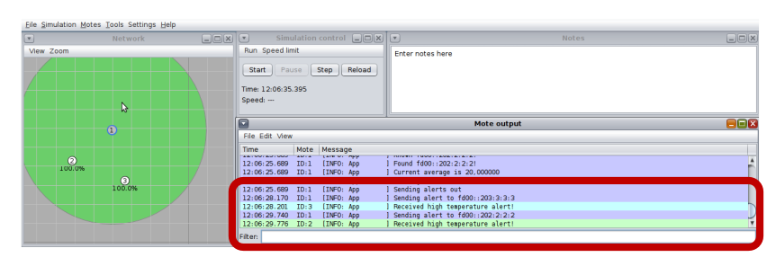

# Evaluation lab - Contiki-NG

## Group number: 21

## Group members

- Aristei Francesco 10804304
- Mazzola Dario 10650009
- Repole Giampiero 10543357

## Problem addressed

You are to implement a simple sensing application:
- A UDP client sends (fake) temperature readings to a server every ~1 minute.
- The UDP server collects the last MAX_READINGS temperature readings coming from clients.
- Every time a new reading is received, the server:

Computes the average of the received temperature readings.

If the average is above ALERT_THRESHOLD, it immediately notifies back-to-back all existing clients of a “high temperature alert”, nothing is sent back otherwise.

Clients may appear at any time, but they never disappear:

- Your solution must be able to handle up to MAX_RECEIVERS clients, no more.
- You can use COOJA motes.
- Multiple calls to simple_udp_sendto in sequence are unlikely to succeed.
- The outgoing queue has size one.

## Solution description
Client:

The client simply used udp protocol of contiki to send the temperature samples with a period of 60s by default and when receives a udp packet from the server hooks a callback that prints the alert message received.

Server:
- It receives the temperatures from the different clients and saves the sender in a list of clients if it is not already present.
- It computes the average of the last MAX_READINGS temperatures and then if this value is greater or equal to the treshold it sends a UDP packet to the clients in the list using a timer in order to not overwrite the outgoing queue.

