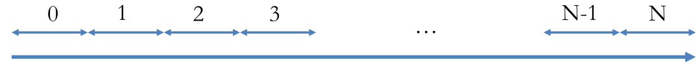

# Evaluation lab - MPI

## Group number: 21

## Group members

- Aristei Francesco 10804304
- Mazzola Dario 10650009
- Repole Giampiero 10543357

## Problem addressed

You are to implement a simple traffic simulator.
Consider a linear road divided into consecutive segments numbered 0..N as in the figure below
– N is represented by variable num_segments in the template.
– You may assume the number of segments to be a multiple of the number of processes.

The simulation evolves in descrete rounds for a given number of iterations
– num_iterations in the template file
At each round
– Some cars enter the road in segment 0
Use function create_random_input() to obtain the number of cars
– Each car either remains in the same segment or moves to the
next one
Use function move_next_segment() to determine if a car moves or not.
Cars that move out of the last segment are not part of the simulation anymore.
Every 10 iterations, you have to compute the total number of cars that are currently within the road
– Process P0 prints the sum
– The code for printing is already in the template
Run the simulation in parallel on multiple processes, minimizing synchronization and communication as much as possible.
You may set DEBUG to 1 to obtain deterministic values and check the correctness of your code
– At each round a single car enters the road
– Cars always move to the next segment

## Solution

Since every process is watching the same road, every process starts with values of its partition of the array of segments set to 0. The process P0 starts by calculating the number of cars entering the road.
Processes that are in the middle between the first and the last process wait for the receiving of the number of cars exiting from the last segment that belongs to the previous process; then they process the number of cars and send it to the following process. 
The last process receives and manages the cars and drops the cars the exits from the road.
